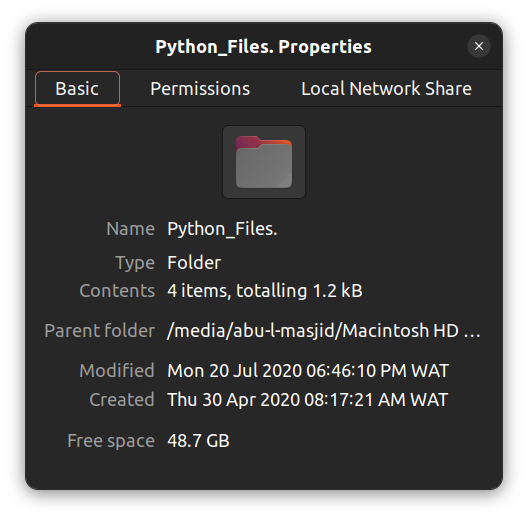

# Python Files Repository

This repository contains Python scripts and related files developed during my university studies. The content reflects practice exercises and prototypes created to improve my understanding of Python concepts and their practical applications. Created and completed between Thu, 30th Apr 2020 and Mon, 20th Jul 2020.

## Repository Overview

The repository includes the following items:  

1. **`Prototype.py`**: A general prototype script, used to experiment with Python functionality or algorithms.  
2. **`Terminal Python Prototype.py`**: A script designed for terminal-based interaction and testing.
3. **`Terminal Saved Output.txt`**: A text document containing saved outputs from terminal-based Python script executions.  
4. **`while loop.py`**: Demonstrates the use of `while` loops in Python to create iterative programs.

## Purpose

This repository serves as a record of my learning journey in Python programming. It includes:

- Exploration of fundamental Python concepts.
- Practical application of loops and terminal interaction.
- Use of Git for source control, marking an introduction to version management.

## Screenshots

Here's a screenshots of the project folder properties:

## License

This repository is shared without any specific license, as it primarily serves as an educational archive.
